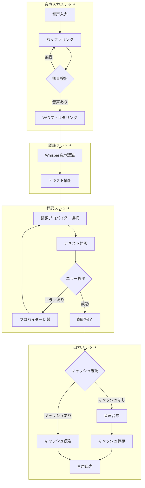

# リアルタイム音声翻訳システム アーキテクチャ設計

## 1. システム概要

本システムは、異なる言語を話すユーザー間のリアルタイムコミュニケーションを可能にする音声翻訳ソリューションです。
スピーカーからの音声入力を取得し、リアルタイムで翻訳して音声出力を行います。

### 主な機能
- スピーカー音声のリアルタイム認識（英語）
- テキスト翻訳（英語→日本語）
- 日本語音声合成出力
- 入出力デバイスの選択
- 音声キャッシング

## 2. 技術スタック

### 音声入力処理
- **sounddevice**:
  - クロスプラットフォーム対応の音声入出力
  - マルチデバイス対応
  - 柔軟なバッファ管理
  - 非同期処理

### 音声認識（Speech-to-Text）
- **faster-whisper**:
  - ローカル実行可能な音声認識
  - GPU/CPU対応
  - VADフィルタリング機能
  - 高精度な認識性能

### テキスト翻訳
- **translate**:
  - 複数の翻訳プロバイダー対応
  - フォールバック機能
  - エラーハンドリング
  - プロバイダー自動切り替え

### 音声合成（Text-to-Speech）
- **gTTS + sounddevice**:
  - 高品質な音声合成
  - 音声キャッシング
  - デバイス選択可能
  - 非同期再生

### システム全体
- **Python**:
  - スレッド管理
  - 非同期処理
  - エラーハンドリング
  - リソース管理

## 3. コンポーネント構成

### クラス構造

```
RealTimeTranslator
├── AudioManager
│   ├── デバイス管理
│   ├── ストリーム制御
│   └── バッファ管理
│
├── SpeechRecognition
│   ├── WhisperModel管理
│   ├── VAD処理
│   └── テキスト抽出
│
├── TranslationEngine
│   ├── プロバイダー管理
│   ├── エラーハンドリング
│   └── フォールバック処理
│
└── AudioOutput
    ├── 音声合成
    ├── キャッシュ管理
    └── デバイス出力
```

### データフロー

1. **音声入力フェーズ**
   - デバイス選択
   - ストリームキャプチャ
   - バッファリング
   - 無音検出

2. **認識フェーズ**
   - VADフィルタリング
   - Whisper音声認識
   - テキスト抽出

3. **翻訳フェーズ**
   - 翻訳プロバイダー選択
   - テキスト翻訳
   - エラーハンドリング

4. **出力フェーズ**
   - キャッシュチェック
   - 音声合成
   - デバイス出力

### 実行フロー図



## 4. 主要コンポーネント詳細

### 音声デバイス管理
```python
def select_audio_devices():
    """入力/出力デバイスの選択"""
    - ステレオミキサー自動検出
    - デバイス一覧表示
    - ユーザー選択処理
    - デバイス設定
```

### 音声バッファ管理
```python
def process_audio():
    """音声データの処理"""
    - バッファサイズ管理
    - 無音検出
    - サンプリングレート制御
    - データ正規化
```

### 翻訳エンジン
```python
def translate_text():
    """テキスト翻訳処理"""
    - プロバイダー選択
    - エラー検出
    - 自動切り替え
    - 結果検証
```

### キャッシュシステム
```python
def generate_speech():
    """音声合成とキャッシュ"""
    - ハッシュベースの管理
    - ファイル変換
    - 自動クリーンアップ
    - 並列処理
```

## 5. スレッド管理

### メインスレッド
- UI処理
- デバイス管理
- エラーハンドリング

### 音声処理スレッド
- 音声キャプチャ
- バッファ管理
- 認識処理

### 翻訳スレッド
- テキスト翻訳
- キャッシュ管理
- 結果通知

### 出力スレッド
- 音声合成
- デバイス出力
- キュー管理

## 6. エラーハンドリング

### デバイスエラー
- デバイス未検出
- ストリーム切断
- バッファオーバーフロー

### 認識エラー
- 音声認識失敗
- VADエラー
- モデルエラー

### 翻訳エラー
- プロバイダーエラー
- 言語検出エラー
- 接続エラー

### 出力エラー
- 合成エラー
- ファイルエラー
- デバイスエラー

## 7. パフォーマンス最適化

### バッファ管理
- 適切なサイズ設定
- メモリ使用量制御
- GC最適化

### キャッシュ戦略
- ファイル管理
- メモリ管理
- 有効期限管理

### スレッド制御
- 負荷分散
- 同期制御
- リソース管理
